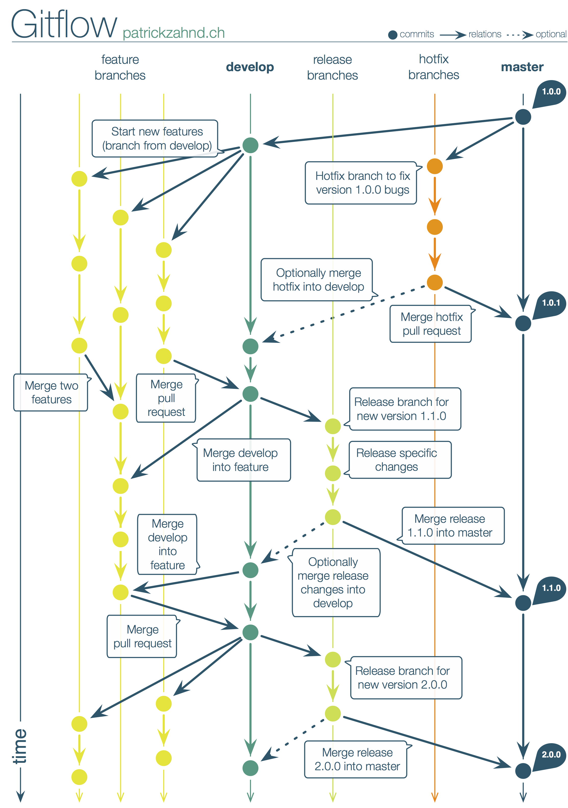

# Git Flow

The base git branching workflow preferred is [GitFlow](http://nvie.com/posts/a-successful-git-branching-model/).
There are 2 main branches that record the history of the project.

*master* - this is the release branch
*development* - the main development branch

Features and fixes are done in separate branches that are deleted once merged with one of the main
branches.
*feature* - branches corresponding to features and bugs that are being implemented




## The master branch

The master branch contains the code that is being shipped to production.
Every major release and hotfix should have a tag associated with it.

## The development branch

The branch where the main development is done.

## Feature branches

It is preferred that feature development and bug fixing should be done on feature branches.
An exception to this rule is when performing really small fixes, these can be done without creating a feature branch.

# Branch naming

Branches should be used for most feature development and bug fixing. The name of the branch should start with the id of the story/bug followed by a short description.

```terminal
467345_some_cool_feature
```

It is preferred to mark branches that contain bug fixes with *_bug_* after the bug identifier.

```terminal
467345_bug_some_weird_functionality
```

# Commit messages

Commits messages should start with the issue identifier they are implementing/fixing followed by a brief description (~ 50 characters).
All the commits within a branch should start with the same issue identifier as the branch.
The commit message should provide useful information to the team. Messages with meaningless information should be avoided.

**Preferred**
```terminal
467345: added submit button
```

**Not Preferred**
```terminal
467345: in the middle of work, to be continued...
```

# Branch merging

It is preferred that a code review is made before every branch is merged.
After the changes are approved in code review, the owner of the branch is responsible to merge it.

Keeping git clean is important so after a feature branch is merged it should be deleted locally and from the remote repository.

In order to have a neat git history the following workflow should be applied when merging a feature branch:

```
git checkout feature_branch              (optional)
git rebase main_branch feature_branch    (optional)
git checkout main_branch
git merge --no-ff feature_branch
```

**WARNING:**  
Never push feature_branch upstream after rebase.

~~git push origin feature_branch~~

If you **are the only one working on the feature branch** and you really have to push the changes upstream then force push them. This command **will completely rewrite the history** on the upstream branch.
```
$ git push --force-with-lease
```

### SourceTree enable do not fast forward when merging

If using SourceTree make sure to disable merge fast forwarding from general settings.


### Avoid merging into feature branches

Avoid merging changes into feature branches if at all possible.


# Cherry picking

Merging is the preferred way of moving commits from one branch to another. Cherry picking should be used only if merging is not possible.

# Tags

Every release should have a tag associated with it.
